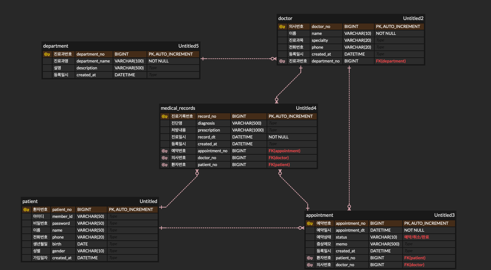

# 🏥 Hospital Reservation System

Spring Boot + MyBatis + MySQL AI 기반 병원 예약 관리 시스템 

진료과 · 환자 · 의사 · 예약 · 진료기록 5개 도메인의 RESTful API를 제공합니다.

> 🌐 **[한국어](./README.md)** | **[English](./README_en.md)**

---

## 📌 프로젝트 개요

병원 예약 업무를 모델링한 풀스택 시스템입니다. 환자가 의사에게 예약을 잡고, 진료 후 진료기록이 남는 실제 병원 워크플로우를 데이터베이스 설계와 REST API로 구현했으며, React 프론트엔드와 AI 기능까지 확장하는 것을 목표로 합니다.

| 항목 | 내용 |
|------|------|
| 개발 기간 | 2026.06 ~ (진행 중) |
| 개발 인원 | 1명 (개인 프로젝트) |
| 핵심 목표 | FK 관계 기반 정규화 설계 + 계층형 아키텍처 REST API + React 연동 |

📄 **[전체 API 명세 보기 → API.md](./api.md)**

---

## 🛠 기술 스택

**Backend**
- Java 21 · Spring Boot 3.5 · MyBatis 3.0 · Spring Web (REST API)

**Frontend**
- React (Vite) · JavaScript (ES6+)

**Database**
- MySQL / MariaDB · 5개 테이블 정규화 설계 (FK 관계)

**Planned (AI / 확장 예정)**
- Python Django (AI 챗봇 서버) · Google Gemini API · LSTM/NLP (감성 분석) · 카카오맵 API

**Tools**
- Maven · Postman · Git / GitHub · Eclipse / VS Code

---

## 🗺 시스템 아키텍처

(■ 구현 완료 / □ 구현 예정)

```
┌─────────────────────────────────────────────────────────────┐
│                         사용자 (브라우저)                      │
└─────────────────────────────────────────────────────────────┘
                              │
                              ▼
┌─────────────────────────────────────────────────────────────┐
│  ■ React Frontend (Vite, :5173)                              │
│     - 진료과/의사 목록, 예약 폼, 예약 조회                     │
│     □ 카카오맵 (병원 위치)   □ 챗봇 UI                         │
└─────────────────────────────────────────────────────────────┘
                              │  REST API (CORS)
                              ▼
┌─────────────────────────────────────────────────────────────┐
│  ■ Spring Boot Backend (:8080)                               │
│     Controller → Service → DAO → MyBatis Mapper              │
└─────────────────────────────────────────────────────────────┘
                              │  JDBC
                              ▼
┌─────────────────────────────────────────────────────────────┐
│  ■ MySQL / MariaDB (:3306)                                   │
│     department · patient · doctor · appointment · medical_record │
└─────────────────────────────────────────────────────────────┘

         □ Django AI Server (예정) - Gemini 챗봇 / LSTM 감성 분석
```

---

## 🖥 화면 흐름 설계

(■ 구현 완료 / □ 구현 예정)

```
■ 메인 페이지 (진료과·의사 목록, □지도, [예약하기])
        ↓
□ 예약 페이지 (환자 정보 → 진료과 → 의사 → 날짜 선택)
        ↓
□ 예약 조회 페이지 (내 예약 목록)
        ↓
□ 리뷰 페이지 (후기 작성 + LSTM 감성 분석)

□ 챗봇 (전 페이지 우측 하단, Gemini 예약 문의 자동 응답)
```

---

## 🗄 데이터베이스 설계 (ERD)



```
department (진료과)
    │
    ├──< doctor (의사)
    │
patient (환자)
    │
    └──< appointment (예약) >──┐
              │                 │
              └──< medical_record (진료기록)
```

**테이블 관계**
- `doctor` → `department` (의사는 하나의 진료과 소속)
- `appointment` → `patient`, `doctor` (예약은 환자-의사 연결)
- `medical_record` → `appointment`, `patient`, `doctor` (진료기록)

**설계 포인트**
- 모든 테이블에 `AUTO_INCREMENT` PK 적용
- `created_at`에 `DEFAULT NOW()`로 생성 시각 자동 기록
- `member_id`에 `UNIQUE` 제약으로 중복 가입 방지
- 진료기록은 예약과 독립적으로 보존 (법적 보관 요건 고려)

---

## 🏗 백엔드 아키텍처

```
Controller  →  Service  →  DAO  →  MyBatis Mapper (XML)  →  MySQL
   (REST)     (비즈니스)   (인터페이스)      (SQL)
```

**계층별 역할 분리**
- **Controller**: HTTP 요청/응답 처리, REST 엔드포인트
- **Service**: 비즈니스 로직 (예: 예약 시 기본 상태 "예약" 설정)
- **DAO**: DB 접근 인터페이스 (`@Mapper`)
- **Mapper XML**: 실제 SQL 쿼리

**패키지 구조**
```
com.hospital.reservation
├── controller   # REST 컨트롤러
├── service      # 비즈니스 로직
├── dao          # MyBatis 매퍼 인터페이스
├── vo           # 테이블 매핑 객체
└── config       # CORS 등 설정

src/main/resources/mapper/   # SQL XML
```

---

## ⚙️ 실행 방법

**1. DB 준비**
```sql
CREATE DATABASE hospital_reservation;
```

**2. application.properties 설정**
```properties
spring.datasource.url=jdbc:mysql://localhost:3306/hospital_reservation
spring.datasource.username=root
spring.datasource.password=your_password
mybatis.configuration.map-underscore-to-camel-case=true
```

**3. 백엔드 실행**
```bash
./mvnw spring-boot:run
```
서버: `http://localhost:8080`

**4. 프론트엔드 실행**
```bash
cd hospital-reservation-frontend
npm install
npm run dev
```
프론트엔드: `http://localhost:5173`

---

## 🔍 주요 트러블슈팅

**1. MyBatis 카멜케이스 매핑**
- 문제: snake_case 컬럼(`department_name`)이 camelCase 필드에 null로 매핑됨
- 해결: `map-underscore-to-camel-case=true` 설정

**2. FK 제약조건 위반**
- 문제: 부모 테이블에 없는 값을 자식이 참조하여 INSERT 실패
- 해결: INSERT 순서 준수 (department → patient → doctor → appointment → medical_record)

**3. MariaDB / MySQL 드라이버 호환**
- 문제: 드라이버와 URL 프로토콜 불일치
- 해결: 드라이버와 `jdbc:mysql://` URL 프로토콜 일치

**4. CORS 정책 (React 연동)**
- 문제: React(:5173)에서 Spring Boot(:8080) 호출 시 CORS 차단
- 해결: `CorsConfig`에서 `/api/**` 경로에 5173 origin 허용

---

## 🚀 진행 사항

- [v] 백엔드 5개 도메인 CRUD + REST API
- [v] React 프론트엔드 초기 연동 (진료과/의사 목록)
- [ ] 예약 폼 / 예약 조회 화면
- [ ] 예외 처리 고도화 (404, 400 상태코드)
- [ ] JOIN 쿼리로 예약 조회 시 환자명·의사명 함께 반환
- [ ] 카카오맵 API 병원 위치 표시
- [ ] Django 기반 AI 챗봇 (Gemini)
- [ ] 진료 후기 감성 분석 (LSTM/NLP)
- [ ] AWS / Render 클라우드 배포

---

## 👤 개발자

**이지애 (Serena)**
- GitHub: [@serelee08](https://github.com/serelee08)
- Email: serelee08@gmail.com
